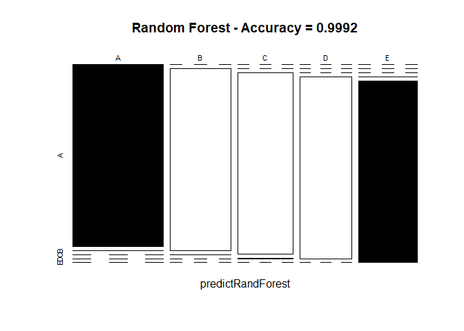
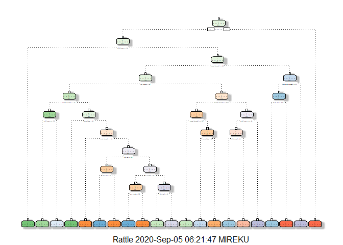
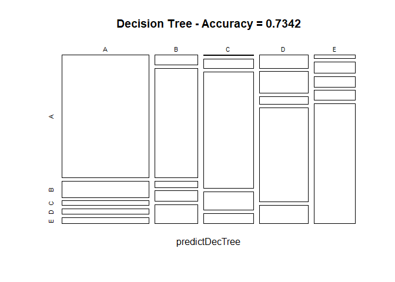
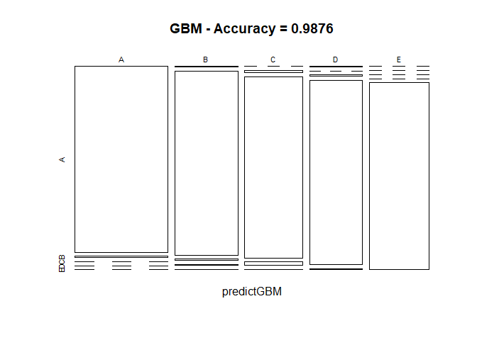

## Prediction Assignment Writeup


## Overview
This document is the final project of the Peer-Graded Assignment from Coursera’s Course Practical Machine Learning, as part of the Specialization in Data Science. It was built up in RStudio, using its knitr functions, meant to be published in html format.

This analysis meant to be the basis for the course quiz and a prediction assignment writeup. The main goal of the project is to predict the manner in which 6 participants performed some exercise as described below. This is the “classe” variable in the training set. The machine learning algorithm described here is applied to the 20 test cases available in the test data and the predictions are submitted in appropriate format to the Course Project Prediction Quiz for automated grading.


## Background
Using devices such as *Jawbone Up*, *Nike FuelBand*, and *Fitbit* it is now possible to collect a large amount of data about personal activity relatively inexpensively. These type of devices are part of the quantified self movement - a group of enthusiasts who take measurements about themselves regularly to improve their health, to find patterns in their behavior, or because they are tech geeks. One thing that people regularly do is quantify how much of a particular activity they do, but they rarely quantify how well they do it. In this project, your goal will be to use data from accelerometers on the belt, forearm, arm, and dumbell of 6 participants. They were asked to perform barbell lifts correctly and incorrectly in 5 different ways. More information is available from the website here: <http://groupware.les.inf.puc-rio.br/har> (see the section on the Weight Lifting Exercise Dataset).


## Data Loading and Exploratory Analysis

### I. Dataset Overview

The training data for this project are available here:
<https://d396qusza40orc.cloudfront.net/predmachlearn/pml-training.csv>

The test data are available here: <https://d396qusza40orc.cloudfront.net/predmachlearn/pml-testing.csv>

A short description of the datasets content from the authors’ website:
“Six young health participants were asked to perform one set of 10 repetitions of the Unilateral Dumbbell Biceps Curl in five different fashions:
        
    exactly according to the specification (Class A), 
    throwing the elbows to the front (Class B), 
    lifting the dumbbell only halfway (Class C), 
    lowering the dumbbell only halfway (Class D) and 
    throwing the hips to the front (Class E).

Class A corresponds to the specified execution of the exercise, while the other 4 classes correspond to common mistakes. Participants were supervised by an experienced weight lifter to make sure the execution complied to the manner they were supposed to simulate. The exercises were performed by six male participants aged between 20-28 years, with little weight lifting experience. We made sure that all participants could easily simulate the mistakes in a safe and controlled manner by using a relatively light dumbbell (1.25kg)."


###  II. Environment Preparation

Upload the R libraries that are necessary to complete analysis.


```r
suppressMessages(library(caret));
suppressMessages(library(randomForest));
suppressMessages(library(rpart));
suppressMessages(library(rpart.plot));
suppressMessages(library(RColorBrewer));
suppressMessages(library(rattle))
set.seed(12345)
```


### III. Data Loading and Cleaning

The next step is downloading the dataset from the URL provided above. The training dataset is then partitioned into two to create a Training set (70% of the data) for the modelling process and a Test set (with the remaining 30%) for the validations. The testing dataset is not changed and will only be used for the quiz results generation.


```r
# loading the datasets into the working environment
training <- read.csv("pml-training.csv")
testing <- read.csv("pml-testing.csv")

# create a partition with the training dataset 
inTrain  <- createDataPartition(training$classe, p=0.7, list=FALSE)
TrainSet <- training[inTrain, ]; TestSet  <- training[-inTrain, ]
dim(TrainSet); dim(TestSet)
```

```
## [1] 13737   160
```

```
## [1] 5885  160
```

The datasets created both have 160 variables. Those variables have plenty of NAs, that can be removed with the cleaning procedures below. The Near Zero variance (NZV) variables are also removed and the ID variables as well.


```r
# remove variables with Nearly Zero Variance
NZV <- nearZeroVar(TrainSet)

TrainSet <- TrainSet[, -NZV]; TestSet  <- TestSet[, -NZV]
dim(TrainSet); dim(TestSet)
```

```
## [1] 13737   104
```

```
## [1] 5885  104
```

```r
# remove variables that are mostly NA
all.NA <- sapply(TrainSet, function(x) mean(is.na(x))) > 0.95

TrainSet <- TrainSet[, all.NA==FALSE]; TestSet  <- TestSet[, all.NA==FALSE]
dim(TrainSet); dim(TestSet)
```

```
## [1] 13737    59
```

```
## [1] 5885   59
```

```r
# remove identification only variables (columns 1 to 5)
TrainSet <- TrainSet[, -(1:5)]; TestSet  <- TestSet[, -(1:5)]
dim(TrainSet); dim(TestSet)
```

```
## [1] 13737    54
```

```
## [1] 5885   54
```

With the cleaning process above, we now have a reduced dataset of 54 variables for our analysis.


## Prediction Model Building

Three methods will be applied to model the regressions (in the Train dataset) and the best one (with higher accuracy will be applied to the Test dataset), which will be used for the quiz predictions. The methods are: 1. Random Forests; 2. Decision Tree and 3. Generalized Boosted Model, as described below.
A Confusion Matrix is plotted at the end of each analysis to better visualize the accuracy of the models.

### 1. Random Forest


```r
# model fit
controlRF <- trainControl(method="cv", number=3, verboseIter=FALSE)
modFitRandForest <- train(classe ~ ., data=TrainSet, method="rf",
                          trControl=controlRF)
modFitRandForest$finalModel
```

```
## 
## Call:
##  randomForest(x = x, y = y, mtry = param$mtry) 
##                Type of random forest: classification
##                      Number of trees: 500
## No. of variables tried at each split: 27
## 
##         OOB estimate of  error rate: 0.19%
## Confusion matrix:
##      A    B    C    D    E  class.error
## A 3905    0    0    0    1 0.0002560164
## B    6 2648    3    1    0 0.0037622272
## C    0    5 2391    0    0 0.0020868114
## D    0    0    8 2244    0 0.0035523979
## E    0    0    0    2 2523 0.0007920792
```

```r
# prediction on Test dataset
predictRandForest <- predict(modFitRandForest, newdata=TestSet)
xtabRandForest <- table(predictRandForest, TestSet$classe)
confMatRandForest <- confusionMatrix(xtabRandForest)
confMatRandForest
```

```
## Confusion Matrix and Statistics
## 
##                  
## predictRandForest    A    B    C    D    E
##                 A 1674    1    0    0    0
##                 B    0 1138    1    0    0
##                 C    0    0 1025    2    0
##                 D    0    0    0  961    0
##                 E    0    0    0    1 1082
## 
## Overall Statistics
##                                          
##                Accuracy : 0.9992         
##                  95% CI : (0.998, 0.9997)
##     No Information Rate : 0.2845         
##     P-Value [Acc > NIR] : < 2.2e-16      
##                                          
##                   Kappa : 0.9989         
##                                          
##  Mcnemar's Test P-Value : NA             
## 
## Statistics by Class:
## 
##                      Class: A Class: B Class: C Class: D Class: E
## Sensitivity            1.0000   0.9991   0.9990   0.9969   1.0000
## Specificity            0.9998   0.9998   0.9996   1.0000   0.9998
## Pos Pred Value         0.9994   0.9991   0.9981   1.0000   0.9991
## Neg Pred Value         1.0000   0.9998   0.9998   0.9994   1.0000
## Prevalence             0.2845   0.1935   0.1743   0.1638   0.1839
## Detection Rate         0.2845   0.1934   0.1742   0.1633   0.1839
## Detection Prevalence   0.2846   0.1935   0.1745   0.1633   0.1840
## Balanced Accuracy      0.9999   0.9995   0.9993   0.9984   0.9999
```

```r
# plot matrix results
plot(confMatRandForest$table, col = confMatRandForest$byClass, 
     main = paste("Random Forest - Accuracy =", 
                  round(confMatRandForest$overall['Accuracy'], 4)))
```

<!-- -->


### 2. Decision Trees


```r
# model fit
modFitDecTree <- rpart(classe ~ ., data=TrainSet, method="class")
fancyRpartPlot(modFitDecTree)
```

<!-- -->

```r
# prediction on Test dataset
predictDecTree <- predict(modFitDecTree, newdata=TestSet, type="class")
xtabDecTree <- table(predictDecTree, TestSet$classe)
confMatDecTree <- confusionMatrix(xtabDecTree)
confMatDecTree
```

```
## Confusion Matrix and Statistics
## 
##               
## predictDecTree    A    B    C    D    E
##              A 1502  201   59   66   74
##              B   58  660   37   64  114
##              C    4   66  815  129   72
##              D   90  148   54  648  126
##              E   20   64   61   57  696
## 
## Overall Statistics
##                                           
##                Accuracy : 0.7342          
##                  95% CI : (0.7228, 0.7455)
##     No Information Rate : 0.2845          
##     P-Value [Acc > NIR] : < 2.2e-16       
##                                           
##                   Kappa : 0.6625          
##                                           
##  Mcnemar's Test P-Value : < 2.2e-16       
## 
## Statistics by Class:
## 
##                      Class: A Class: B Class: C Class: D Class: E
## Sensitivity            0.8973   0.5795   0.7943   0.6722   0.6433
## Specificity            0.9050   0.9425   0.9442   0.9151   0.9579
## Pos Pred Value         0.7897   0.7074   0.7505   0.6079   0.7751
## Neg Pred Value         0.9568   0.9033   0.9560   0.9344   0.9226
## Prevalence             0.2845   0.1935   0.1743   0.1638   0.1839
## Detection Rate         0.2552   0.1121   0.1385   0.1101   0.1183
## Detection Prevalence   0.3232   0.1585   0.1845   0.1811   0.1526
## Balanced Accuracy      0.9011   0.7610   0.8693   0.7936   0.8006
```

```r
# plot matrix results
plot(confMatDecTree$table, col = confMatDecTree$byClass, 
     main = paste("Decision Tree - Accuracy =", 
                  round(confMatDecTree$overall['Accuracy'], 4)))
```

<!-- -->


### 3. Generalized Boosted Model


```r
# model fit
controlGBM <- trainControl(method = "repeatedcv", number = 5, repeats = 1)
modFitGBM <- train(classe ~ ., data=TrainSet, method = "gbm", 
                   trControl = controlGBM, verbose = FALSE)
modFitGBM$finalModel
```

```
## A gradient boosted model with multinomial loss function.
## 150 iterations were performed.
## There were 53 predictors of which 52 had non-zero influence.
```

```r
# prediction on Test dataset
predictGBM <- predict(modFitGBM, newdata=TestSet)
xtabMatGBM <- table(predictGBM, TestSet$classe)
confMatGBM <- confusionMatrix(xtabMatGBM)
confMatGBM
```

```
## Confusion Matrix and Statistics
## 
##           
## predictGBM    A    B    C    D    E
##          A 1669   11    0    0    0
##          B    3 1117    9    4    2
##          C    0   11 1012   20    1
##          D    2    0    5  940    5
##          E    0    0    0    0 1074
## 
## Overall Statistics
##                                           
##                Accuracy : 0.9876          
##                  95% CI : (0.9844, 0.9903)
##     No Information Rate : 0.2845          
##     P-Value [Acc > NIR] : < 2.2e-16       
##                                           
##                   Kappa : 0.9843          
##                                           
##  Mcnemar's Test P-Value : NA              
## 
## Statistics by Class:
## 
##                      Class: A Class: B Class: C Class: D Class: E
## Sensitivity            0.9970   0.9807   0.9864   0.9751   0.9926
## Specificity            0.9974   0.9962   0.9934   0.9976   1.0000
## Pos Pred Value         0.9935   0.9841   0.9693   0.9874   1.0000
## Neg Pred Value         0.9988   0.9954   0.9971   0.9951   0.9983
## Prevalence             0.2845   0.1935   0.1743   0.1638   0.1839
## Detection Rate         0.2836   0.1898   0.1720   0.1597   0.1825
## Detection Prevalence   0.2855   0.1929   0.1774   0.1618   0.1825
## Balanced Accuracy      0.9972   0.9884   0.9899   0.9863   0.9963
```

```r
# plot matrix results
plot(confMatGBM$table, col = confMatGBM$byClass, 
     main = paste("GBM - Accuracy =", 
                  round(confMatGBM$overall['Accuracy'], 4)))
```

<!-- -->


## Applying the Selected Model to the Test Data

The accuracy of the 3 regression modeling methods above are:
        
    a.	Random Forest : 0.9992
    b.	Decision Tree : 0.7342
    c.	Generalized Boosted Model : 0.9876

In that case, the Random Forest model will be applied to predict the 20 quiz results (testing dataset) as shown below.


```r
predictTEST <- predict(modFitRandForest, newdata=testing)
predictTEST
```

```
##  [1] B A B A A E D B A A B C B A E E A B B B
## Levels: A B C D E
```


## References

Ugulino, W.; Cardador, D.; Vega, K.; Velloso, E.; Milidiu, R.; Fuks, H. **Wearable Computing: Accelerometers' Data Classification of Body Postures and Movements**. Proceedings of 21st Brazilian Symposium on Artificial Intelligence. Advances in Artificial Intelligence - SBIA 2012. In: Lecture Notes in Computer Science. , pp. 52-61. Curitiba, PR: Springer Berlin / Heidelberg, 2012. ISBN 978-3-642-34458-9. DOI: 10.1007/978-3-642-34459-6_6.
Cited by 2 (Google Scholar)

Read more: <http://groupware.les.inf.puc-rio.br/har#ixzz6X7oIpaUq>


### Other HAR Related Publications

Velloso, E.; Bulling, A.; Gellersen, H.; Ugulino, W.; Fuks, H. **Qualitative Activity Recognition of Weight Lifting Exercises**. Proceedings of 4th International Conference in Cooperation with SIGCHI (Augmented Human '13) . Stuttgart, Germany: ACM SIGCHI, 2013.

Read more: <http://groupware.les.inf.puc-rio.br/har#ixzz6X7pBAOXF>


Ugulino, W.; Ferreira, M.; Velloso, E.; Fuks, H. **Virtual Caregiver: Colaboração de Parentes no Acompanhamento de Idosos**. Anais do SBSC 2012, IX Simpósio Brasileiro de Sistemas Colaborativos , pp. 43-48. São Paulo, SP: IEEE, 2012. ISBN 978-0-7695-4890-6.

Read more: <http://groupware.les.inf.puc-rio.br/har#ixzz6X7pI2gAW>


[^1]: Velloso, E.; Bulling, A.; Gellersen, H.; Ugulino, W.; Fuks, H. Qualitative Activity Recognition of Weight Lifting Exercises. Proceedings of 4th International Conference in Cooperation with SIGCHI (Augmented Human '13) . Stuttgart, Germany: ACM SIGCHI, 2013.
[^2]: Ugulino, W.; Ferreira, M.; Velloso, E.; Fuks, H. Virtual Caregiver: Colaboração de Parentes no Acompanhamento de Idosos. Anais do SBSC 2012, IX Simpósio Brasileiro de Sistemas Colaborativos , pp. 43-48. São Paulo, SP: IEEE, 2012. ISBN 978-0-7695-4890-6.

